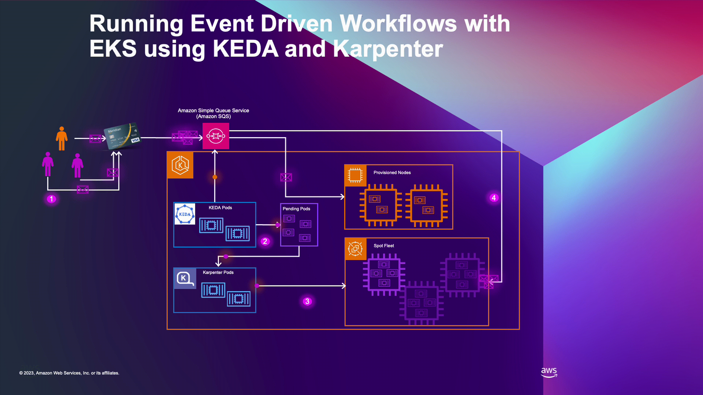

# 🚀 EKS Autoscaling com KEDA e Karpenter

<p align="center">
  <a href="img/aws_kedakarpenter_arch_small.gif">
    
  </a>
</p>

> 🎬 **[Veja a animação completa da arquitetura](img/aws_kedakarpenter_arch_small.gif)** 

<p align="center">
  
  
  
  
  
  
</p>

---

## 📋 Sobre o Projeto

Este lab demonstra **autoscaling avançado no Kubernetes** usando:
- **AWS EKS** 1.31
- **Karpenter** 1.0.1 (Node Autoscaling)
- **KEDA** 2.15.1 (Pod Autoscaling)

> 🎬 **[Veja a animação completa da arquitetura](img/aws_kedakarpenter_arch_small.gif)** 


### 🎯 Cenários Validados

#### 1. 📊 **Processamento de Filas SQS**
- ✅ Escala automática de **1 → 50+ pods** baseado em mensagens SQS
- ✅ KEDA monitora fila FIFO em tempo real
- ✅ Karpenter provisiona novos nós em **60-90 segundos**
- ✅ Processamento de pagamentos com persistência no DynamoDB

#### 2. 🖥️ **Node Scaling com Karpenter**
- ✅ Provisionamento automático de nodes EC2
- ✅ Scale-down inteligente após 30s sem carga
- ✅ Suporte a múltiplos instance types (m5.large, m5.xlarge, m5.2xlarge)

---
## ✨ **VERSÃO CORRIGIDA E FUNCIONAL**

> **Esta é a versão atualizada do lab Eks-Keda_karpenter**, completamente refatorada e testada com as APIs mais recentes do Karpenter e KEDA.

---

## 🎯 Features atualizadas

| # | Solução Implementada |
|---|-------------------|---------------------|
| 1 | ✅ Karpenter aualizado para **v1.0.1** com APIs `v1` estáveis |
| 2 | ✅ Migrado para **NodePool** e **EC2NodeClass** |
| 3 | ✅ Atualizado para **KEDA v2.15.1** com API estável |
| 4 | ✅ Configuração automática de tags em subnets e SGs |
| 5 | ✅ Trust policies corrigidas e testadas |
| 6 | ✅ Pods com `requests: 500m CPU` para forçar scaling |
| 7 | ✅ Validação completa em cada etapa |
| 8 | ✅ Dependências verificadas automaticamente |

---

## 🔧 Pré-requisitos

### 📦 Ferramentas Necessárias

```bash
# Verificar instalação
aws --version      # AWS CLI 2.x+
kubectl version    # kubectl 1.28+
eksctl version     # eksctl 0.150+
helm version       # Helm 3.x+
python3 --version  # Python 3.8+
```

### ☁️ Requisitos AWS

- Conta AWS ativa
- Credenciais configuradas: `aws configure`
- Permissões IAM para EKS, EC2, VPC, SQS, DynamoDB, IAM, CloudFormation

---

## 🚀 Instalação Rápida (25 minutos)

### 1️⃣ Clone o Repositório

```bash
# Escolha o diretório de sua preferência
cd ~

git clone https://github.com/jlui70/lab-eks-keda-karpenter.git
cd lab-eks-keda-karpenter
```

### 2️⃣ Configure Variáveis (Opcional)

```bash
nano deployment/environmentVariables.sh
```

**Valores padrão funcionam perfeitamente:**
- Cluster: `eks-demo-scale-v2`
- Região: `us-east-1`
- Karpenter: `v1.0.1`
- KEDA: `v2.15.1`

### 3️⃣ (Recomendado) Execute Pré-Verificação

⚠️ **IMPORTANTE:** Se você já executou este lab anteriormente e fez cleanup, execute a pré-verificação para garantir que não há recursos órfãos:

```bash
./scripts/pre-install-check.sh
```

Este script vai:
- ✅ Verificar se o cluster já existe
- ✅ Limpar CloudFormation stacks órfãs (`DELETE_FAILED`)
- ✅ Remover VPCs órfãs
- ✅ Deletar IAM Roles órfãs

💡 **Quando executar:**
- Sempre que tentar reinstalar após um cleanup
- Se encontrar erro de "Stack already exists"
- Se o cleanup anterior falhou

### 4️⃣ Execute Deployment Completo

```bash
chmod +x deployment/_main.sh
./deployment/_main.sh
```

⏱️ **Tempo total: ~25 minutos**

```
Etapa 1/4: Cluster EKS .......... 15-20 min
Etapa 2/4: Karpenter ............ 3-5 min
Etapa 3/4: KEDA ................. 2-3 min
Etapa 4/4: AWS Services ......... 1 min
```

---
## 🧪 Executando os Testes

### ⚙️ Preparação do ambiente para visualização do teste

#### 🛠️ Opção 1: Usando K9s (Recomendado)

**K9s** é uma interface CLI interativa para Kubernetes que facilita muito a visualização e navegação dos recursos.

**Instalação do K9s:**

```bash
# Linux
curl -sS https://webinstall.dev/k9s | bash

# macOS (Homebrew)
brew install derailed/k9s/k9s

# Verificar instalação
k9s version
```

Abra **4 terminais** side-by-side:

**Terminal 1 - Pods (namespace keda-test):**
```bash
# Opção A: Visualização via kubectl
watch kubectl get pods -n keda-test

# Opção B: Visualização via k9s (abre direto nos pods do namespace)
k9s -n keda-test
# Dentro do k9s: digite :pods (Enter) para ver Pods keda-test
```

**Terminal 2 - HPA / ScaledObject:**
```bash
# Opção A: Visualização via kubectl
watch kubectl get hpa -n keda-test

# Opção B: Visualização via k9s (dentro do k9s digite :hpa)
k9s -n keda-test
# Dentro do k9s: digite :hpa (Enter) para ver HorizontalPodAutoscaler
```

**Terminal 3 - Nodes (cluster):**
```bash
# Opção A: Visualização via kubectl
watch kubectl get nodes

# Opção B: Visualização via k9s (dentro do k9s digite :nodes)
k9s -n nodes
# Dentro do k9s: digite :nodes (Enter) para ver os nodes do cluster
```

**Terminal 4 - Fila SQS (opcional - somente via AWS CLI):**
```bash
# Monitorar quantidade de mensagens na fila em tempo real
watch -n 5 'aws sqs get-queue-attributes \
  --queue-url https://sqs.us-east-1.amazonaws.com/794038226274/keda-demo-queue.fifo \
  --attribute-names ApproximateNumberOfMessages \
  --query "Attributes.ApproximateNumberOfMessages" \
  --output text'
```

💡 **Dica K9s:** 
- Use `k9s -n <namespace>` para abrir direto no namespace desejado
- Dentro do k9s, navegue com `:pods`, `:hpa`, `:nodes`, `:scaledobject`
- Pressione `Enter` em um recurso para ver detalhes e logs
- Pressione `Ctrl+C` para voltar ou sair

---

### 📊 Teste SQS Scaling

```bash
cd tests
chmod +x run-load-test.sh
./run-load-test.sh
```

**O script vai perguntar quantas mensagens enviar:**

```
Opção 1: Digite um número (ex: 500)
Opção 2: Digite 'continuous' para modo contínuo
```

💡 **Sugestão para testes rápidos:** Envie **500 mensagens** para observar o scaling em ação. Nos testes de laboratório, esse volume demonstrou claramente o comportamento do sistema:
- ⚡ **~3 minutos** para escalar até **50 pods**
- 🚀 **10 nodes** provisionados automaticamente pelo Karpenter
- 📊 Ideal para validar KEDA + Karpenter trabalhando juntos

### 🎯 O que esperar:

1. ✅ **0-30s**: KEDA detecta mensagens e começa a escalar pods
2. ✅ **30-60s**: Pods ficam `Pending` (aguardando nodes)
3. ✅ **60-90s**: Karpenter provisiona novos nodes EC2
4. ✅ **90-120s**: Pods são agendados e começam a processar
5. ✅ **Após fila esvaziar + 30s**: Scale-down automático

---

### ⚡ Scale-Down Rápido (Para Laboratório)

⚠️ **IMPORTANTE:** Em produção, o KEDA e Karpenter fazem o scale-down automaticamente conforme as configurações (cooldown periods, thresholds, etc.). No entanto, para **economizar custos durante testes em laboratório**, você pode forçar um scale-down imediato após validar o comportamento do sistema.

**Comandos para Scale-Down Imediato:**

```bash
# 1️⃣ Limpar todas as mensagens da fila SQS
aws sqs purge-queue \
  --queue-url $(aws sqs get-queue-url --queue-name keda-demo-queue.fifo --query 'QueueUrl' --output text)

# 2️⃣ Deletar o ScaledObject (KEDA para de escalar)
kubectl delete scaledobject sqs-scaledobject -n keda-test

# 3️⃣ Escalar manualmente o deployment para 1 réplica
kubectl scale deployment sqs-app -n keda-test --replicas=1

# 4️⃣ Verificar pods sendo removidos
kubectl get pods -n keda-test

# 5️⃣ Aguardar ~60s e verificar nodes sendo removidos pelo Karpenter
watch kubectl get nodes
```

**Recriar o ScaledObject após os testes (opcional):**

```bash
# Se quiser fazer novos testes, recrie o ScaledObject
kubectl apply -f deployment/app/scaledobject.yaml
```

💡 **Explicação:**
- **Produção:** O KEDA aguarda o `cooldownPeriod` (300s padrão) após a fila esvaziar para fazer scale-down gradual
- **Laboratório:** Limpamos a fila e removemos o ScaledObject para scale-down instantâneo e economia de custos
- **Karpenter:** Remove nodes automaticamente após ~60s quando não há pods agendados neles

---

## 📊 Monitoramento com Prometheus + Grafana

### 🎨 Dashboards Customizados

O projeto inclui stack completa de monitoramento com 2 dashboards profissionais:

#### **1. SQS Payments Dashboard**
- 📨 Mensagens processadas em tempo real
- 🚀 Número de pods ativos (KEDA scaling)
- 💻 Utilização de CPU/Memória
- ⚡ Taxa de processamento (msgs/s)
- 📊 Histórico de scaling

### 📍 Acessar Grafana

# Port-Forward (local)
kubectl port-forward svc/monitoring-grafana 3000:80 -n monitoring
```

Acesse: **http://localhost:3000**

**Credenciais padrão:**
```
Usuário: admin
Senha: admin123
```

### 🔍 Verificar Métricas no Prometheus

```bash
# Port-forward Prometheus
kubectl port-forward svc/monitoring-kube-prometheus-prometheus 9090:9090 -n monitoring
```

Acesse: **http://localhost:9090**

**Queries úteis:**
```promql
# Mensagens na fila SQS
aws_sqs_approximate_number_of_messages

# Pods ativos KEDA
kube_deployment_status_replicas{namespace="keda-test"}

# Nodes Karpenter
karpenter_nodes_total
```

📚 **Documentação completa**: [monitoring/README.md](monitoring/README.md)

---

## 🧹 Limpeza de Recursos

⚠️ **IMPORTANTE:** Execute após os testes para evitar custos!

```bash
cd scripts
chmod +x cleanup.sh
./cleanup.sh
```

**Digite `DELETE` para confirmar.**

O script remove:
- ✅ Cluster EKS completo
- ✅ Todos os nodes EC2
- ✅ VPC, subnets, NAT gateways
- ✅ SQS queue
- ✅ DynamoDB table
- ✅ IAM roles e policies
- ✅ CloudFormation stacks

⏱️ **Tempo: ~10-15 minutos**

### 🔧 Troubleshooting do Cleanup

**Problema: Cleanup termina mas stacks ficam em DELETE_FAILED**

Isso pode acontecer se houver dependências entre recursos. O cleanup agora força a deleção, mas você pode precisar verificar:

```bash
# 1. Verificar stacks órfãs
aws cloudformation list-stacks \
  --stack-status-filter DELETE_FAILED CREATE_FAILED \
  --region us-east-1 \
  --query 'StackSummaries[?contains(StackName, `eks-demo-scale-v2`)].{Name:StackName,Status:StackStatus}'

# 2. Se encontrar stacks órfãas, execute o script de pré-verificação
./scripts/pre-install-check.sh
```

**Recursos órfãos comuns (NÃO geram custo):**
- ✅ CloudFormation stacks em DELETE_FAILED (sem custo)
- ✅ VPC sem recursos ativos (sem custo)
- ✅ Security Groups órfãos (sem custo)
- ✅ IAM Roles/Policies (sem custo)

**Recursos que GERAM custo (são sempre deletados primeiro):**
- ❌ EC2 Instances
- ❌ NAT Gateways
- ❌ EKS Control Plane
- ❌ Load Balancers

💡 **Dica:** Se quiser verificar manualmente se há custos, acesse o [AWS Cost Explorer](https://console.aws.amazon.com/cost-management/home?#/home)

---

## 💰 Custos Estimados

| Recurso | Custo/hora | Custo Lab (3h) |
|---------|-----------|----------------|
| EKS Control Plane | $0.10 | $0.30 |
| NAT Gateways (3x) | $0.135 | $0.40 |
| EC2 Nodes (2-5x m5.large) | ~$0.50 | ~$1.50 |
| SQS + DynamoDB | < $0.01 | < $0.01 |
| **TOTAL** | **~$0.75/h** | **~$2.00** |

💡 **Dica:** Execute `cleanup.sh` imediatamente após os testes!

---

## 🔗 Links Úteis

- [Karpenter v1 Migration Guide](https://karpenter.sh/docs/upgrading/v1-migration/)
- [KEDA v2 ScaledObject Spec](https://keda.sh/docs/latest/concepts/scaling-deployments/)
- [AWS EKS Best Practices](https://aws.github.io/aws-eks-best-practices/)

---

## 🙏 Créditos e Agradecimentos

### 📚 Versão Original

**Projeto Base:** [aws-samples/amazon-eks-scaling-with-keda-and-karpenter](https://github.com/aws-samples/amazon-eks-scaling-with-keda-and-karpenter)

### 🌟 Tecnologias Utilizadas

Agradecimentos especiais às comunidades open-source:

- **AWS EKS** - Managed Kubernetes service
- **Karpenter** - Just-in-time node provisioning
- **KEDA** - Kubernetes Event-driven Autoscaling
- **Prometheus** - Cloud-native monitoring
- **Grafana** - Metrics visualization
- **Helm** - Kubernetes package manager
- **Python** - Application development
- **eksctl** - EKS cluster management

### 💙 Comunidade

Este projeto foi criado para ajudar a comunidade brasileira de DevOps, SRE e Cloud Engineering a implementar autoscaling avançado de forma prática e automatizada.

---

## 📞 Contato e Suporte

### 🌐 Conecte-se Comigo

- 📹 **YouTube:** [DevOps Project](https://www.youtube.com/@devops-project)
- 💼 **Portfólio:** [devopsproject.com.br](https://devopsproject.com.br/)
- 💻 **GitHub:** [@jlui70](https://github.com/jlui70)

### 💬 Precisa de Ajuda?

- 🐛 Abra uma [issue no repositório](https://github.com/jlui70/lab-eks-keda-karpenter/issues)
- 💡 Participe das discussões no YouTube
- 📧 Entre em contato via portfólio

### 🌟 Gostou do Projeto?

Se este projeto foi útil para você:

- ⭐ Dê uma **estrela** no [repositório](https://github.com/jlui70/lab-eks-keda-karpenter)
- 🔄 **Compartilhe** com a comunidade
- 📹 **Inscreva-se** no canal do YouTube
- 🤝 **Contribua** com melhorias

---

## 📄 Licença

MIT License - Este projeto está licenciado sob a licença MIT.

---

<p align="center">
  <strong>Desenvolvido com ❤️ para a comunidade brasileira de DevOps, SRE e Cloud Engineering</strong>
</p>

<p align="center">
  <sub>EKS Autoscaling com KEDA e Karpenter • 2025-2026 • Todos os direitos reservados</sub>
</p>
